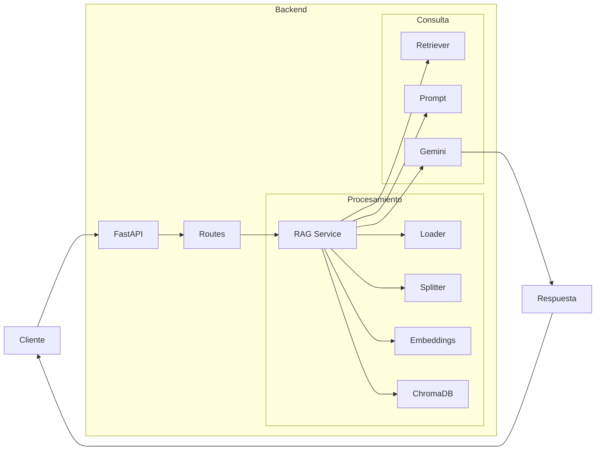

# ChatBot RAG y FastAPI

Este proyecto es un ejemplo de cómo implementar un chatbot utilizando Retrieval-Augmented Generation (RAG) con FastAPI. El chatbot puede responder a preguntas basándose en información recuperada de una base de datos o documentos.

## Diagrama de arquitectura



El cliente envía una solicitud al servidor FastAPI, que maneja la solicitud a través de sus rutas. El servicio RAG se encarga de procesar la información, recuperando datos relevantes y generando una respuesta utilizando un modelo de lenguaje como Gemini. Finalmente, la respuesta se envía de vuelta al cliente.

## Entorno virtual

```bash
python -m venv venv
# En Windows
venv\Scripts\activate
# En Unix o MacOS
source venv/bin/activate
```

## Instalar dependencias

```bash
pip install -r requirements.txt
```

## Ejecución

```bash
uvicorn main:app --reload
```